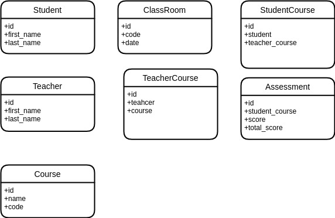

# Student Management System
The Student Management System is a web application that allows administrators to manage students, courses, and enrollment records. 
The application is built using Python and Flask, and uses a MySQL database to store the data.

## Features
- Add, edit, and delete students
- Add, edit, and delete courses
- Enroll and unenroll students in courses
- View student records and course records
- Generate reports and export data
  
## Installation
Clone the repository: git clone https://github.com/fiifi-dev/student-manage-system.git
Install the dependencies: `PIPENV_VENV_IN_PROJECT=1 pipenv install`
Activate venv: `pipenv shell`
Create  Mysql Database: `CREATE DATABASE student_management_system;`
Run migrations: `alembic upgrade head`
RUN application: ` uvicorn main:app `
The application should now be running on http://localhost:8000.

## Database DML

License
The Student Management System is open source software licensed under the MIT license.